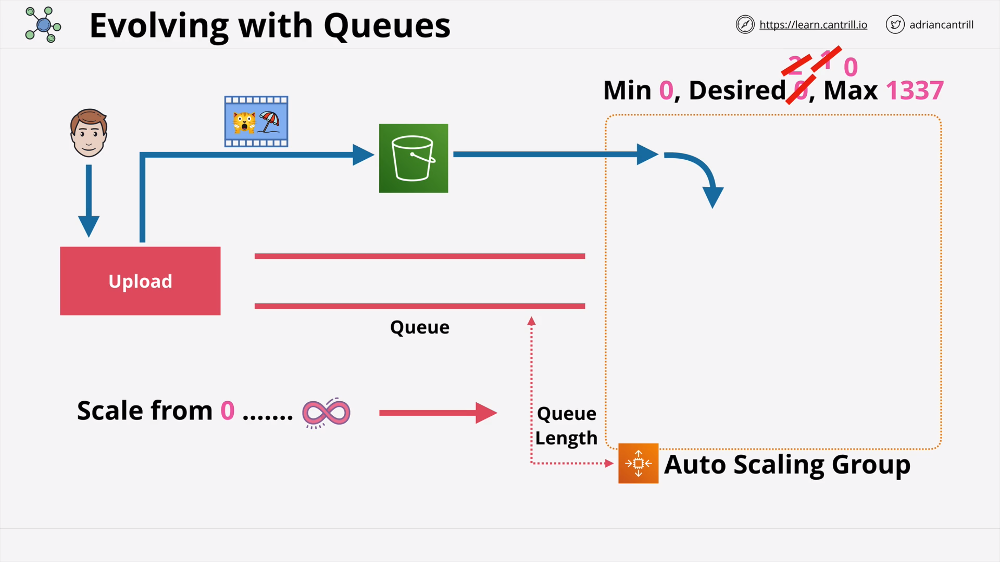

# TASK -10 : Serverless and Application Services

 - Architecture Deep Dive Part 1
 - Architecture Deep Dive Part 2
 - AWS Lambda Part 1
 - AWS Lambda Part 2
 - AWS Lambda Part 3
 - CludWatchEvents and Event Bridge
 - Automated EC2 Control using lambda and events Part 1 (DEMO)
 - Automated EC2 Control using lambda and events Part 2 (DEMO)
 - Serverless Architecture
 - Simple Notification Service (SNS)
 - Step Functions
 - API Gateway 101
 - Build a serverless app part 1
 -  Build a serverless app part 2
 - Build a serverless app part 3
 - Build a serverless app part 4
 - Build a serverless app part 5
 - Build a serverless app part 6
 - Simple Queue Service (SQS)
 - SQS Stadanard vs FIFO Queus
 - SQS Delay Queues

# 1. Arhitecture Deep Dive - part 1

### Monolitna arhitektura

1. Ako jedan dio "padne" , onda propada i cijela arhitektura
2. Dijelovi takodjer skaliraju zajedno, jer ne mozes jedan sloj skalirati bez ostalih.
Generalno, u monolitnoj arhitekturi moramo vertikalno skalirati sistem, jer sve radi na istom dijelu hardware-a.
3. Najvazniji aspekti monolitne arhitekture je: da se dijelovi naplacuju zajedno, jer kapacitet sistema treba biti dovoljan da bi se pokretalo sve zajedno. 
Zato oni moraju uvijek imati alocirane resurse, iako ih ne "konzumiraju" zajedno.
 
- Za razliku od monolitne arhitekture imamo i slojevitu arhitekturu.
Monolitna arhitektura je razdvojena u zasebne dijelove ili slojeve.
Svaki od tih slojeva moze biti na istom serveru, ali i na razlicitim serverima. 
U ovoj arhitekturi razlicite komponente su i dalje povezane zajedno, jer svaki od slojeva pokazuje na isti "endpoint" od drugog sloja.

 

### Slojevita arhitektura

 - Kod slojevite arhitekture svaki od slojeva moze biti i vertikalno skaliran zasebno.
Npr. ako sloj procesiranja zahtijeva vise kapaciteta procesora (CPU) , onda moze biti povecan bez da budu povecani i ostali slojevi.
- Ali slojevita arhitektura je evoluirala i dalje : 
Umjesto da je svaki sloj direktno povezan sa drugim mozemo pokrenuti **load balancer-e** locirane izmedju npr. : 3 sloja .
To znaci da oni ne komuniciraju direktno vec preko **internih load balancera** koji onda omogucavaju i **horizontalno skaliranje** sto znaci da se dodatne instance mogu dodavati i uklanjati. I to onda omogucava **visoku dostupnost (highly available)**
Ako jedna instanca "padne" , load balancer redistribuira veze prema drugim "zivim" instancama.
- Ova arhitektura ipak nije savrsena zbog dva vazna razloga:
1. Slojevi su i dalje povezani, jedan od slojeva ocekuje da je njegov susjedni sloj dostupan za odgovore;
2. Ako nema poslova koji bi trebali biti procesirani, sloj za procesiranje mora imati nesto pokrenuto da bi aplikacija funkcionirala.

* * *
# 2. Arhitecture Deep Dive - part 2

- Prethodna arhitektura moze biti unaprijedjena koristenjem redova (queues).
- Red je sistem koji prima poruke (messages).
- Poruke mogu biti unaprijedjene koristenjem reda.
- Poruke mogu biti primljene u red ili izvucene iz reda.
- Poruke se primaju u FIFO arhitekturi (First-In-First-Out).
- FIFO koristi asinkronu komunikaciju: 
dok jedan sloj radi u pozadini, drugi koji zavrsi svoj posao, sprema ga u FIFO arhitekturu .
 

U nasem primjeru na kraju FIFO arhitekture nalazi Auto-Scaling grupa koja ima svoju velicinu reda (queue length) . 
Ta Auto-Scaling grupa koja ima svoju velicinu reda i setuje je na 2, tako da iz reda (Queue) izalze po 2 zadatka. Ali oni znaju i za lokaciju S3 bucketa i objekta u tom bucketu, i tako mogu primiti i glavni (master) video iz s3 bucketa.              Ove instance su procesirane i izbrisane iz reda (queue), tako da Auto Scaling grupa moze odluciti da skalira prema dole jer je pozeljna velicina reda = 2, a u redu ima samo jedna item. Zatim prime i posljednju poruku iz reda i zavrsava se sa tim procesiranjem poruke. Tada ona postavlja pozeljnu velicinu reda na 0, i to rezultira terminiranjem i zadnje instance.
 
Koristenjem reda (queue) arhitekture izmedju ovih slojeva, ona u biti logicki razdvaja ove slojeve i takodjer omogucava visoku dostupnost i skaliranje, i nijedan sloj ne komunicira direktno.
To znaci da moze skalirati od 0 do beskonacno, ovisno kolika je velicina poruke u redu (queue).
Ovo je inace veoma popularna arhitektura jer koristi **asinkronu komunikaciju.**

 

### Arhitektura mikroservisa

Ako nastavimo razbijati monolitnu aplikaciju na sve manje dijelove doci cemo do pojma **arhitekture mikroservisa** , koja je u sustini kolekcija mikroservisa.

Stvar koju mikroservisi primaju i daju arhitekturalno su dogadjaji (events).
Velike arhitekture mogu postati jako kompleksne i to vrlo brzo, gdje servisi trebaju da razmjenjuju podatkeizmedju partnerskih mikroservisa.
Ako bi to uradili sa redom - to bi radilo , ali bi bilo prekompleksno.

 

### Event-Driven arhitektura

Zato se uvodi pojam Event-Driven arhitekture koja je samo kolekcija od kreatora dogadjaja (events) koji mogu biti komponente aplikacije, ili sistem za nadzor komponenti i to je samo jedan dogadjaj . 
Proizvodjac (producer) su stvari koji proizvode dogadjaje , a suprotno od tog su potrosaci koji cekaju da se dogadjaj pojavi i ako vide dogadjaj, oni ce nesto poduzeti i pokrenuti taj dogadjaj i zavrsiti ga.
Oni ne konzumiraju resurse konstantno, jer bi to bilo previse.
Najbolja praksa je da izmedju njih postoji Event Router koji je visoko dostupan i centralno mjesto za razmjenjivanje dogadjaja , koji mozemo zamisliti kao konstantni protok informacija . 
Kad su dogadjaji generirani od Producer-a , Event Router koji je visoko dostupan ai cenralno mjesto za razmjenjivanje poruka, mozemo ga zamisliti kao konstantni protok informacija.
Kad su dogadjaji generirani od Producer-a, Event Router alocira te resurse i skalira komponente kako je potrebno.

 

- Event-Driven arhitekture konzumiraju samo resurse kada su oni potrebni:
1. Zato nema nista da je konstantno pokrenuto ili da ceka neke stvari.
2. Producers generiraju dogadjaje kad se nesto dogodi.
3. Dogadjaji su dostavljeni Consumerima preko Event Routera.

**- Zakljucak:**
**Event-driven arhitektura konzumira samo resurse dok "hendla" dogadjaje!**
I to je kljucan dio **serverless arhitekture.**
* * *
# 3. AWS Lambda - part 1

- Lambda funkcionira kao usluga ili brzi protokol, a to znaci da sa njom pruzamo specijalizirani kratki kod Lambdi i onda ona preuzima brigu da ga pokrece i naplacuje ti samo ono sto potrosis.
- Lambda funkcija je u biti dio koda koji ona pokrece i svaka Lambda funkcija uzima podrzano vrijeme izvrsavanja (npr. : Python 3.8.)
- Znaci da su funkcije preuzete i pokrenute u okruzenje vremena izvrsavanja, koje je specificno kreirano da pokrece kod koristeci odredzeno vrijeme izvrsavanja i odredjeni programski jezik.
- Kada kreiramo Lambda funkciju ujedno definiramo i odredjene resurse koji su pokrenuti u vremenu izvrsavanja , tako da alociramo direktno i odredjeni dio memorije i na osnovu te memorije i odredjeni dio CPU-a.
- Lambda naplacuje samo period vremena koji ta funkcija koristi.
- Lambda je kljucni dio serverless ili event-driven arhitekture.
- Kada zamisljamo kako Lambda funkcionira treba je zamisliti kao kod plus sve asocirane biblioteke i konfiguracije.
- Kada pokrenemo Lambdu definiramo i jezik u kojem je ta funkcija napisana.
- Kad je Lambda funkcija pozvana , ustvari se dogadja da paket za "deplojanje" je preuzet i izvrsen u njegovom vremenu izvrsavanja.
- Lambda podrzava mnogo programskih jezika:
Python, Ruby , Java, Go, C#, Rust,...
- Docker je u biti suprotan Lambdi.
- Lambda moze koristiti Docker slike, ali se to mora razlikovati od znacenja rijeci Docker, jer su to dvije potpuno razlicite stvari.
- Docker se u biti odnosi na rad sa kontejnerima, tj. Docker sliku koristimo u okruzenju kontejnera , kao sto je ECS.
- Svaki put kada je Lambda pozvana novo vrijeme izvrsavanja (runtime) je kreirano sa svim komponentama koje Lambda treba.
- Lambda funkcije su stateless , sto znaci da nijedan podatak nije ostavljen iz prethodnog poziva funkcije.
- Svaki put kada je Lambda pozvana, onda se kreira novi runtime (vrijeme izvrsavanja) .
- Svaki put za Lambdu alociramo i odredjene resurse.
- Mi sa Lambdom direktno kontroliramo alociranu memorijuod njene funkcije, ali tamo gdje je virtualni CPU alociran indirektno, sto zanci da vise memorije povlaci za sobom i vise virtualnog CPU kapaciteta.
- Takodjer je alociran i odredjeni dio storage-a (hard disk), koji moze skalirati, ali to je samo trenutno (temporary).
- Lambde mogu trajati do 900 sekundi ili 15 minuta, i to je jako bitan podatak.
- Svaka Lambda funkcija ima i svoju Rolu, koju kacimo na specificnu funkciju.

 

- Lambda USE CASES:
1. Serverless aplikacije: S3, API Gateway, Lambda;
2. Procesiranje dokumenata : S3, S3 Events, Lambda;
3. Trigeri baza podataka: DynamoDB, Streamovi, Lambda;
4. Serverless CRON jobovi: Event Bridge;
5. Procesiranje podataka u realnom vremenu sa Lambdom: (Kinesis + Lambda)

* * *
# 4. AWS Lambda - part 2

- Lambda moze funkcionirati u 2 mrezna moda:
1. javni (public) mod - koji je default;
2. VPC (Virtual Private Cloud).

1. Na javnom pristupu moze pristupiti javnim AWS servisima i javnom Internetu.
- Javni mrezni pristup pruza najbolje performanse jer specificni korisnicki VPC nije potreban. Ali zato Lambda funkcije nemaju pristup VPC orjentiranim servisima, jedino u slucaju ako imaju javnu IP adresu i dozvoljene permisijevanjskom pristupu, i to je veliki hendikep.
2. Ako je Lamda konfigurirana unutar VPC-ija i subneta, Lambda funkcije se pridrzavaju svih VPC mreznih pravila i mogu pristupiti svim resursima unutar tog VPC. Ali zato ne mogu pristupiti svim resursima van VPC, osim u slucaju preko gateway endpointa ili preko NAT Gateway-a.
 

- Lambda se u VPC tretira kao bilo koji drugi resurs unutar VPC-ija.
 

### Sigurnost Lambda funkcija:

- Po defaultu Lambda ima "egzekucijsku" rolu za sigurnost, slicnu kao sto ima EC2 instanca svoju rolu.
- Ali Lambda ima i policy resursa koji kontroliraji:
- STA servisi i nalozi mogu POKRENUTI od Lambda funkcija.
- Permisije se mogu rucno promjenuti kroz CLI ili API.

### Logovi

- Lambda za logove koristi: Cloudwatch, Cloudwatch logs i X-Ray
- Cloudwatch Logs koji zahtjevaju permisije preko EXecution role;
Logovi iz Lambda egzekucija idu na CLoudwatch Logs.
- Metrke su pohranjene u Cloudwatch.
- Lambda moze biti integrirana sa X-Ray.

* * *
# 5. AWS Lambda - part 3

Postoje 3 metode za pozivanje Lambde :
- Sinkrono pozivanje;
- Asinkrono pozivanje;
- Event-source mapiranje.

1. Kod sinkronog pozivanja Lambde preko CLI/API pozivamo Lambda funkcije, prosljedjujuci podatke i cekajuci odgovor.
Lambda tada vraca podatke bili oni uspjesni ili neuspjesni.
Moguce je i pozivanje Lambde kroz API Gateway , ali je princip isti:
rezultat se vraca kao uspjesan ili neuspjesan i vracen je za vrijeme request-a.
Sinkorna komunikacija je izvrsena kada covjek direktno ili indirektno poziva Lambda funkciju.
2. Asinkrona komunikacija se tipicno dogadja kada AWS servis poziva Lambda funkciju.
- Primjer je kada S3 poziva Lambdu, koji tada ne ceka nikakav odgovor.
Dogadjaj (event ) je generiran i S3 prestaje pracenje.
Recimo da Lambda koristi DynamoDB kao nerelacionu bazu podataka.
Ako procesiranje dogadjaja padne, Lambda ce pokusati ponovno izmedju 0 i 2 puta kao sto je i podeseno.
- Inace, Lambda koristi logiku ponavljanja.
- Kod mora biti "idempotent" , a to znaci da koliko god se puta izvrsava, izlaz mora biti isti.
- Idealno bi bilo kada bi Lambda zavrsila u pozeljnom stanju (desired state).
- Novi feature Lambde je mogucnost da kreira destinacije (SQS, SNS, Lambda i Event Bridge), gdje uspjesan ili neuspjesan dogadjaj moze biti poslan.
3. Event Source mapiranje
- Ono je tipicno uradjeno za strimanje ili redove (queues).
- Primjer je kada  Kinesis strimanje podataka posalje batch iz izvora u Event Source mapping, te ga onda prosljedjuje kao batch dogadjaja Lambdi.
- 
 

### Lambda verzije

- Mozemo imati verzije funkcije Lambda: V1, V2, V3,...
- Verzija je u biti: kod + konfiguracija Lambda funkcije.
- Verzije su nepromjenjive - jednom kad je publicirana nikad se vise ne mjenja i ima svoj ARN.
- $Latest - pokazuje na zadnju verziju.
- Aliasi se mogu mjenjati i pokazuju na odredjenu verziju, npr: DEV, STAGE, PROD.
- Kada je Lambda pozvana (recimo iz S3), taj koncept ekzekucije mora biti napravljen i kofiguriran.
Prvo se kreira okruzenje, a onda se skida zadnja verzija programskog jezika (npr: Python 3.8).
Zatim se skida paket deploymenta i instalira se - i taj proces se zove COLD START (cca. 100 mili sekundi).
Poslije slijedi proces koji se zove WARM START, koji ne treba pravljenje okruzenja ili skidanje paketa, itd.
Tu onda dogadjaj (Event) pocinje odmah procesiranje (cca: 1-2 mili sekunde).
Moze se tada upotrijebiti proces "Provisioned concurrency" da se nebi stvarao COLD START vise puta i on kreira i sacuvava WARM START kontekst , koji je spreman za upotrebu i tako znacajno unapredjuje brzinu samog starta.

* * *
# 6. CLOUDWATCH EVENTS & EVENT BRIDGE

- Cloudwatch Events daje skoro real-time strimove sistemskih dogadjaja koji objasnjavaju promjene u AWS produktima i servisima.
- Event Bridge je servis koji zamjenjuje Cloudwatch Events.
- Moze izraditi sve kao i Cloudwatch Events, ali moze i 3-rd party i kastomizirane aplikacije .
- Oba dijele istu baznu arhitekturu, ali AWS forsira migraciju na Event Bridge.
- On moze odraditi neki servis za neki period vremena (slicno kao CRON).
- Event Bridge je u biti Cloudwatch verzija 2.
- Oba koriste defaultni Event Bus za korisnicki profil.
- U Event Bridge se mogu dodati i dodatni bus-ovi.
- Pravila prate ulazne dogadjaje (events) ili mogu biti Shedules (sto je slicno CRON-u u Linuxu).
- 
 

- Primjer:
- Kada EC2 instanca promjeni stanje iz stopiranog u pokrenuto i  u Event Busu imamo vise takvih pokrenutih instanci , tada Event Bridge nadgleda sve dogadjaje (event-e)
- Event je u formi JSON podatka, sto takodjer ukljucuje koja je instanca promjenila svoje stanje.

 * *
# 7. Automated EC2 Control using LAMBDA and EVENTS

- Napravit cemo dvije EC2 instance i odredjeni broj Lambda funkcija koje ce sa njima komunicirati na razlicite nacine (jedna stopira instance , 1 pokrece instnace i finalna ce cuvati instance tj. brinuti se da se ne zaustave):

 

- Ovo je primjer Event-Driven workflow-a, tj. kako Lambda reagira kad se nesto dogodi unutar AWS racuna.

 * *
# 8. SERVERLESS arhitektura

- **Serverless** nije samo jos jedan obicni pojam. Serverless je vise softverska arhitektura, nego hardverska.
- Svi koji rade na AWS cloudu na nacin Serverless ciljaju da upravljaju sa sto manje servera, pa da onda budu sto manji troskovi.
- Serverless svoju arhitekturu najvise temelji na mikroservisima i event-driven arhitekturi.
- U Serverless je glavni cilj da razbijemo aplikaciju na sto vise manjih dijelova sto je to moguce, pa cak i dalje od samih mikroservisa !
- Tada su aplikacije kolekcije malih i specijaliziranih funkcija.
- Aplikacije se pokrecu u Stateless i kratkotrajnim okruzenjima.
- Razlog zasto je Lambda jeftina je : zato sto je ona **skalabilna**
- Sve je Event-Driven (pokrenuto dogadjajima) , a to znaci:
- **Nista nije pokrenuto dok za to nema potrebe .**
- Lambda kao servis se placa, bazirano na trajanju njene egzekucije.
- Serverless bi trebao biti veoma blizu besplatne cijene, dok se ne dogodi neki dogadjej u tom okruzenju .
- Serverless bi trebao koristiti kad je to god moguce managed (upravljajuce) servise, tako da ne moramo praviti svoje.
- U serverlessu je glavni cilj da koristimo servise kad je god to moguce i da pisemo sto kraci kod, te koristimo FaaS za svaku potrebu koju procesiranje treba, i zatim sve te dijelove zajedno iskoristimo da bi kreirali finalnu aplikaciju.

 

- U primjeru se vidi da je pomocu staticne web stranice -> Google Identity Provider, Cognito i S3 Bucket u koji stavimo nas video nam omogucavaju da kao Solution Arhitekti u biti ne trebamo upravljati arhitekturom nikako, u smislu kreiranja EC2 instanci, vec je to sve automatizirano koristeci managed (upravljajuce) servise.
- Dogadjaj koji smo kreirali pokrece Lambduda procesira taj video.
A onda Lambda kreira job (posao) sa Elastic Transcoder, koji je upravljani servis od AWS.
- Elastic Transcoder zatim transkodira taj video u razlicite velicine i sprema to u DynamoDB.
- Drugi dio je kada korisnik poziva novu Lambda Funkciju, koja direktno komunicira sa Transcode Bucketom i DynamoDB bazom.
- U stvarnom okruzenju bi bio koristen jos i API Gateway izmedju korisnika i Lambda funkcije da zastiti od mogucih malicioznih napada hackera sa Interneta.
- Tu nemamo puno troskova i samoupravljajucih resursa.

* *
# 9. Simple Notification Service (SNS)

- SNS je visoko dostupan, trajan i siguran servis za poruke (messages).
- To je javni AWS servis, sto znaci mreznu konektivnost sa javnim AWS enpoint-ima.
- Najveci benefit je to da je dostupan svugdje sto ima pristup Internetu.
- SNS u sustini koordinira slanje i prihvacanje poruka.
- Poruke su payload-i manji od 256 KB.
- SNS Topic je bitna stvar , jer je to bazni entitet SNS-a (permisije i konfihguracija).
- SNS ima koncept Publisher-a, što je u biti nesto sto salje poruke prema Topic-u
- Topic ima svoje Subscribers (pretplatnike) koji primaju poruke.
- Subscribers mogu biti:
HTTP(S) endpointi, Email adresa, SQS queues, Mobile notifikacija, SMS poruke, pa cak i sama Lambda.
- SNS se koristi preko AWS produkata i servisa.

 

- Poruke se salju u Topic, pa ih prihvataju Subscribers gdje se moze staviti Filter koji onda limitira te poruke da bi ih mogao primiti samo relevantan Subscriber za tu poruku.
- Koristeci FANOUT je odlican nacin slanja jedne poruke u SNS Topic koja reprenzetira jedan procesirajuci opseg posla (workload) i da ga ondaprebaci na vise redova.

 

- SNS pruza Status dostave (ukljucujuci HTTP, Lambda, SQS) prema pretplatnicima.
- SNS pruza Delivery Retries (ponavljanja) - sto znaci pouzdanu dostavu.
- SNS je visoko dostupan i sklabilan ali samo u jednoj regiji.
- Server enkripcija (SSE) je jos jedna bitna odlika SNS.

* *
# 10. STEP FUNKCIJE
- Some problems with Lambda:
1. Lambda je FaaS (Function-as-a-Service).
2. Lambda ima 15 minuta ogranicenje njene egzekucije.
3. Posto se Lambda funkcije mogu povezati, pozivanjem druge Lambda funkcije- u teoriji mozemo dobiti dodatnih 15 minuta , ali to onda postaje komplicirano kod skaliranja.
4. Runtime okruzenja Lambde su po prirodi Stateless.

 

### STATE MACHINES

- State machines imaju serverless workflow: START -> STATES -> END
- States (stanja) su stvari koja se dogadjajuunutar State machines.
- State machine je zamisljena da radi neku aktivnost ili neki flow (slijed) koji sadrzi mnogo individualnih komponenti.
- Maksimalno vrijeme trajanja State Machines je 1 godina.
-  Standard workflow traje 1 godinu.
-  Express workflow moze posluziti za IOT, striming podataka, procesiranje i transformaciju podataka.

 

- State machines se generalno koriste za backend procesiranje.

- Amazon State Language se koristi za predloske (templates) i bazira se na JSON-u.
- Za permisije se koriste IAM role.

 

Vrste stanja (states):

1. Uspjelo (succed) i neuspjelo(fail);
2. cekanje (wait);
3. izbor (choice);
4. paralelno stanje (parallel);
5. map;
6. Task stanje (Lambda, Batch, DynamoDB, ECS, SNS, SQS, Glue, SageMaker, Step Funkcije,..)

# 11. API Gateway 101

- API Gateway je servis koji nam omogucava da kreirate i upravljate API-jima.
- API je aplikacijski programski interfejs i to je nacin na koji aplikacije komuniciraju medjusobno.
- API Gateway se ponasa kao Endpoint ili Entry point za aplikacije da mogu komunicirati sa servisima.
- Arhitekturalno se nalazi izmedju aplikacija i integracija (backend servisa koji pruzaju funkcionalnost tog API-ja).
- API je visoko dostupan, skalabilan, upravlja autorizacijom , kesiranjem, transformacijama, omogucava direktnu integraciju sa AWS servisima i jos mnogo toga...
- API Gateway moze povezati servise/endpoint-e u AWS-u ili on-premise serverima.
- API Gateway moze pruziti :HTTP APIs, REST APIs i Websocket APIs.

 

- API Gatewy podrzava dosta metoda autentifikacije:
1. API Gateway moze koristiti Cognito skupove korisnika za autentifikaciju.
2. API Gatewey moze biti prosiren da koristi Lambda baziranu autentifikaciju.

 

### API Gateway tipovi Endpointa:

1. Edge-optimizirani (koji su rutirani najblizem Cloudfront POP);
2. Regionalni (klijenti su u istoj regiji);
3. Privatni (Endpointi su dostupni samo u VPC-u preko endpoint interfejsa);

 

API Gateway Stages:

 
  
 
 ### API Gatewey greske (errors):
 
 - 4XX - Client greske ;
 - 5XX -Server greske

1. 400 - los zahtjev;
2. 403 - nije dozvoljen pristup;
3. 502 - bad gateway izuzetak;
4. 503 - Servis nije dostupan;
5. 504 - Greska integracije.

 

### API Gateway - keširanje

 
 
 
* *
# 12. Build a Serverless App

- TO DO

 

* *
# 13. Simple Queue Service (SQS)

- SQS je javna , potpuno upravljana i visoko dostupna usluga redova (queues):
1. Standardni redovi;
2. FIFO redovi.

 

- Poruke mogu biti velike do 256 KB (mogu se linkovati na velike podatke);
- Primljene poruke su u biti skrivene ( Vsibility Timeout );
- Ako se poruka ne pojavi na vrijeme, ona ce se sigurno pojaviti nakon ponovnog pokusaja ili ce biti eksplicitno izbrisana;
- Kocept "Dead-Letter queues" mogu biti iskoristeni za poruke koje imaju neki problem kod dostavljanja;
- ASG (Auto Scaling Groups) mogu skalirati i pozvati Lambdu na osnovu velicine reda (queue).

 

- SQS workflow sa ASG:

 

- SNS i SQS sa Fanout (realni primjer iz prakse):

 

- SQS:

- Standardna - najmanje jedna (at-least-once) dostava;
- FIFO - garantira poredak poruka dozvoljava egzaktno jednu poruku odjednom;
- FIFO performanse : 3 000 poruka po sekundi sa batchevima, ili 300 poruka po sekundi bez batcheva;
- Naplacuje se po jednom zahtjevu : 1 - 10 poruka do 64 KB ukupno.
- Kratke (short) i Duge (Wait Time Seconds) poruke postoje u SQS;
- Enkripcija (KMS) i enkripcija u tranzitu;

* *
# 15. SQS Delay Queues

- Visibility Timeout se generalno koristi za ispravak greski i automatsko **reprocesiranje**.
- Delay Queue (kasnjenje reda) je znacajno razicit od Visibility Timeout , jer poruke pocinju u nevidljivom stanju za taj vremenski period.
Kada kasnjenje (delay) istekne, poruke ce postati vidljive u tom redu (queue).
- Message timers su dobri za konfiguraciju SQS redova , minimalno je 0 a maksimalno 15 minuta.
- Delay Queues se genralno koriste kada imate potrebu napraviti kasnjenje (delay) u procesiranju za nasu aplikaciju.

