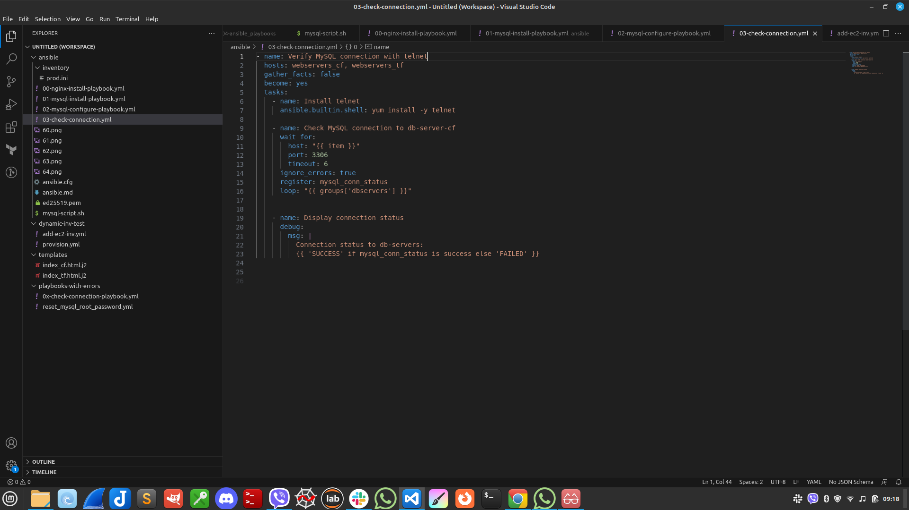

# Ansible
* * *

- **Ansible has many advanteges from other IaC tools:**

**1. It is declarative and uses easy-to-read YAML language.
2. Ansible only works with one executable.
3. It does not require agents to be installed on the VMs to be configured.
4. A simple SSL/WinRM connection is required for Ansible to connect to remote VMs.
5. It has a teplate engine and a vault to encrypt/decrypt sensitive data.
6. It is idempotent.**

- **There are two types of Ansible invenories:**

1. Static inventory: Hosts are listed in a text file in INI ( or YAML) format;
2. **Dynamic inventory : The list of hosts is dynamically generated by an external script.
The dynamic inventory is used if we do not have the addresses of the hosts.**

* * *

 # TASK - 12 : Solution

 - U inventory/prod.ini su dodane grupe hostova. Hostovi su dodati rucno, koristeci output Template-a gdje smo mogli vidjeti Public Ip adrese.

- Grupe hostova su:

```
[webservers_cf]
# za web instance kreirane koristeci CF

[webservers_tf]
# za web instance kreirane koristeci TF

[dbservers]
# za db instance 
```


- Ovakvim priistupom je olaksan proces dodjele razlicitih index.html fajlova.

### Instalacija nginx servisa

- Za instalaciju nginx servisa potrebno je uraditi sljedece

- Unutar ansible-playbooks direktorija, pokrenuti playbook 01-nginx-install-playbook.yml

- Za CloudFormation i Terraform  kreirana su dva posebna index.html fajla i dodati su na sledeci nacin:

```
  name: Configure webserver with nginx
  hosts: webservers_cf, webservers_tf
  become: True
  vars:
    ansible_python_interpreter: /usr/bin/python3
  tasks:
    - name: Install nginx 
      yum:
        name: nginx
        state: latest

    - name: Start nginx
      service: 
        name: nginx
        state: started
        enabled: yes


- name: Update index.html in CloudFormation webservers
  hosts: webservers_cf
  become: True
  vars:
    ansible_python_interpreter: /usr/bin/python3
  tasks:
  
    - name: copy index.html
      template: src=templates/index_cf.html.j2 dest=/usr/share/nginx/html/index.html
        mode=0644

    - name: restart nginx
      service: name=nginx state=restarted


- name: Update index.html in Terraform webservers
  hosts: webservers_tf
  become: True
  vars:
    ansible_python_interpreter: /usr/bin/python3
  tasks:
  
    - name: copy index.html
      template: src=templates/index_tf.html.j2 dest=/usr/share/nginx/html/index.html
        mode=0644

    - name: restart nginx
      service: name=nginx state=restarted
```

- Komanda za pokretanje playbook-a je
 `ansible-playbook -i inventory/prod.ini 00-nginx-install-playbook.yml`

- Izmjena index.html fajla na task-12-web-server-cf instanci


  - Izmjena index.html fajla na task-12-web-server-tf instanci


## Instalacija mysql na db server instance

- Pokrenemo playbook `$ ansible-playbook -i inventory/prod.ini 01-mysql-install-playbook.yml`
    
- Nakon ovoga imamo instaliran mysql na db server instancama:





* * *

- **Nakon ovoga imamo instaliran mysql na db server instancama:**


- Defaultna baza na ec2 instanci:


- uspjesno pokrenut playbook : `02-mysql-configure-playbook.yml`


- Uspjesno kreirana nova baza `task-12-db` : 


