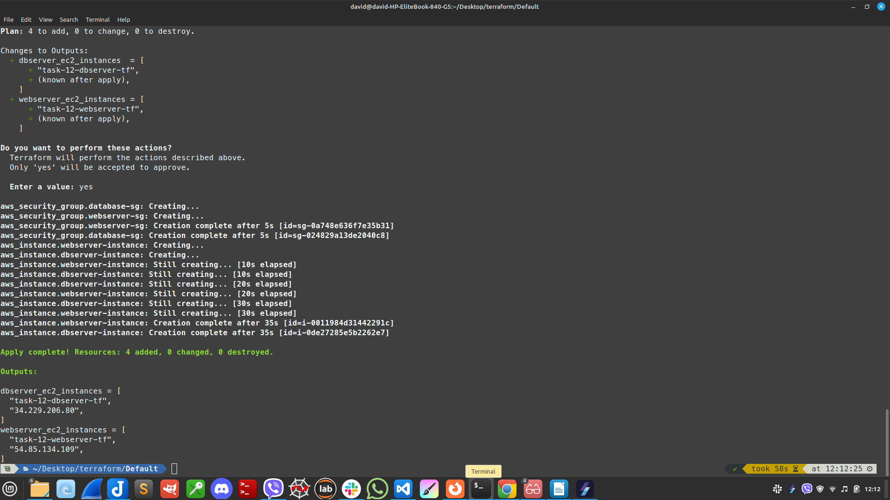
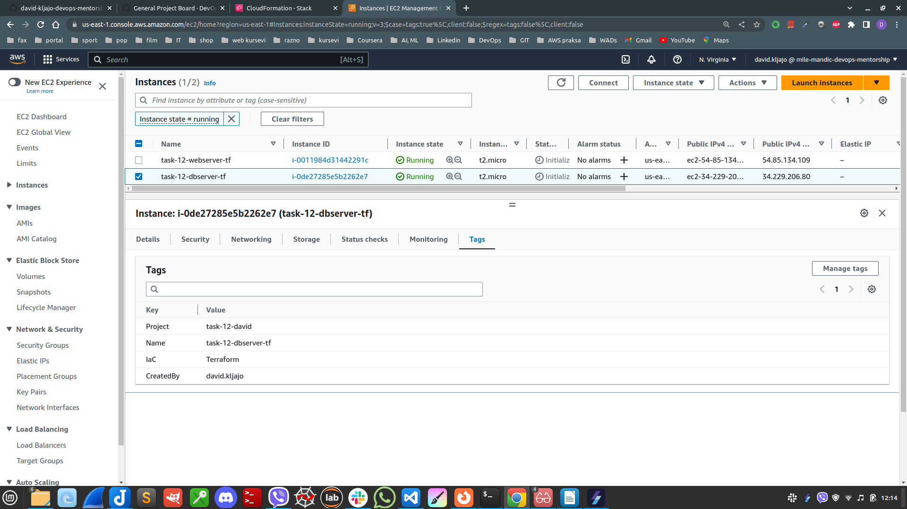

# Terraform
* * *

- Terraform is a command-line tool that, in its basic version, is open source, uses the **HashiCorp Configuration Language (HCL)** , is declarative, and is relatively easy to read.
- Its main advantage in the use of the same language to deploy on a multitude of cloud providers such as AWS, Google and Azure.
- Terraform has other advantages:
1. **It is multiplatform**, and it can be installed on Windows, Linux and Mac.
2. **It allows a preview of infrastructure changes before they are implemented.**
3. **It allows parallelization of operations by considering resource dependencies.**
4. **It integrates a very large number of providers.**

* * *
# Task 12 - solution

* * *

## AWS Provider:

- It is used for configuring credentials
-  `providers.tf` file is shown bellow:

```bash
terraform {
  required_providers {
    aws = {
      source  = "hashicorp/aws"
      version = "~> 4.0"
    }
  }
}
# Configure the AWS Provider
provider "aws" {
  region                   = "us-east-1"
  shared_config_files      = ["~/.aws/config"]
  shared_credentials_files = ["~/.aws/credentials"]
  profile                  = "david.kljajo"
}
```

##  main.tf file

-  `main.tf`  creates resources. 

##  SG for webserver i dbserver instances:


```bash
resource "aws_security_group" "webserver-sg" {
  description = "Allow SSH and HTTP access"
  
   tags = {
    Name = "task-12-sg-webserver-tf"
    CreatedBy = "david.kljajo"
    Project = "task-12-david"
    IaC = "Terraform"
  }
```





### Kreiranje EC2 instanci

- All code is available :
-  `terraform/Default/main.tf`




## Terraform commands:

```bash
$ terraform init 
$ terraform plan # dry run
$ terraform apply 
```

