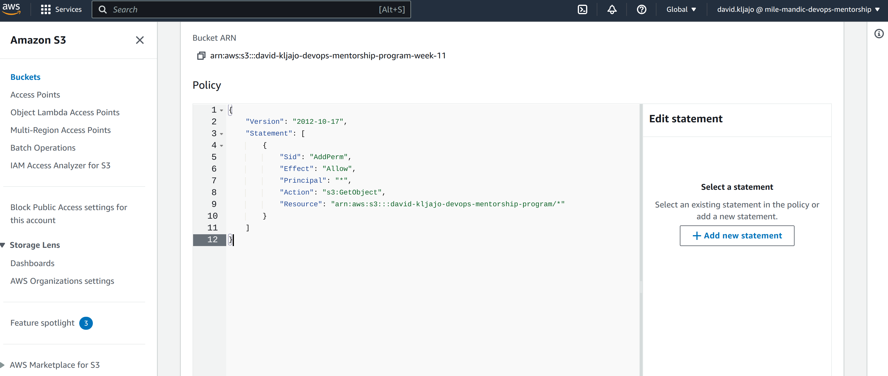
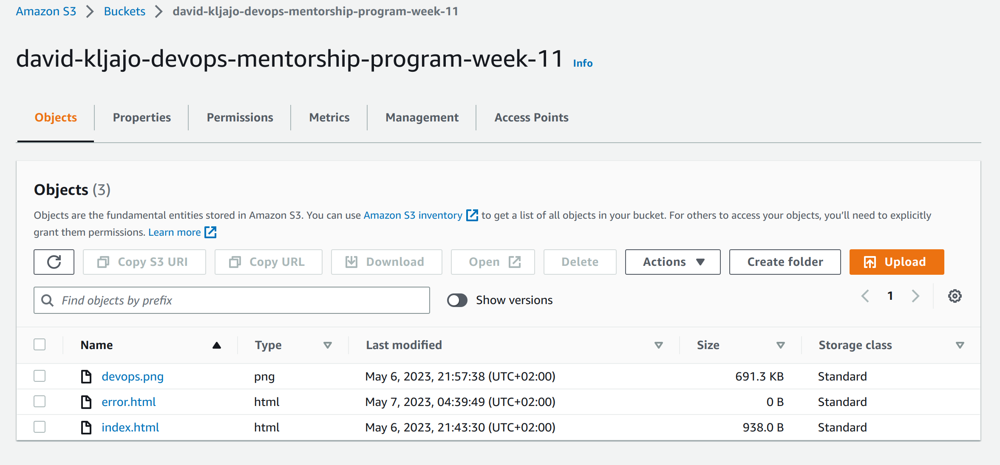
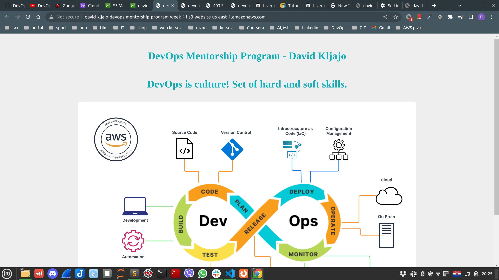
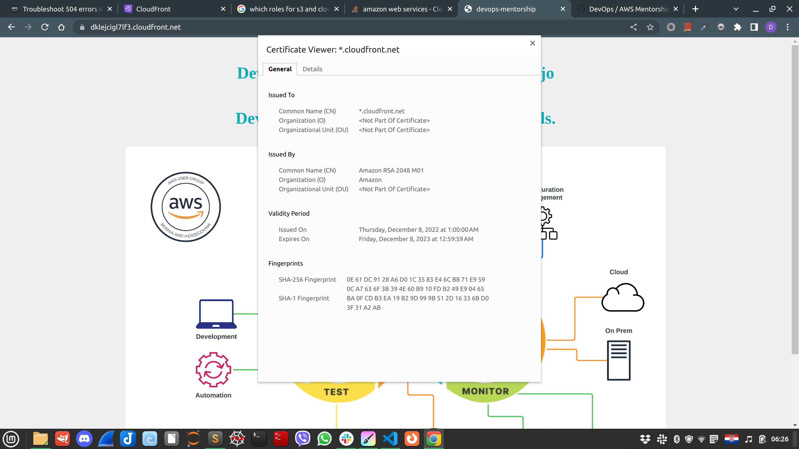
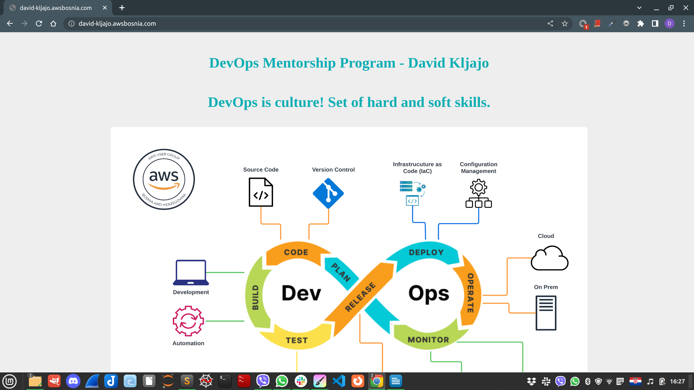
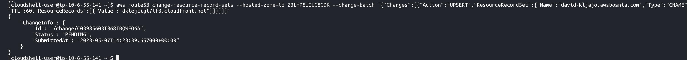

TASK - 9

Potrebno je kreirati S3 bucket u formatu: ime-prezime-devops-mentorship-program-week-11, te omogućiti static website:

Dodati .html i error.html file,
Podesiti bucket na public access, te dodati bucket policy koji će omogućiti samo minimalne access permissions nad bucketom.
Drugi dio zadatka jeste objaviti tu statičku web stranicu kroz CloudFront distribuciju.

Prilikom kreiranja CloudFront distribucije potrebno je samo sljedeće opcije modifikovati:

Origin domain,
Name,
Viewer protocol policy (Redirect HTTP to HTTPS),
Custom SSL certificate,
SSL certifikat koristite od AWS Certificate Manager-a.

Sve ostale opcije po default ostaviti. Kada se završi kreacija distribucije napraviti record unutar Route 53 ( www.ime-prezime.awsbosnia.com) koji će pokazivati na tu distribuciju.

Konfiguraciju Route 53 odraditi na sličan način kroz CLI kao u prethodnom zadatku (TASK-8) gdje će Vaš record pokazivati na distrubuciju.

Ovo su primjeri navedenih endpointa koje je potrebno dostaviti:

S3 website endpoint primjer: S3 static web
Primjer distribution endpointa: d1ax7sali2r51c.cloudfront.net
Primjer R53 recorda: www.boris-bradic.awsbosnia.com
Da biste kompletirali ovaj task potrebno je dostaviti sljedeće kroz PR:

U komentar postaviti:

S3 website endpoint - non-encrypted
vaš-distribution.net endpoint - encrypted
R53 record - encrypted
Bucket može ostati na private, ali je potrebno u tome slučaju prilagoditi bucket policy.

Kreirati novi direktorijum za navedeni task i u njega smjestiti:

S3 bucket policy screenshot ( voditi računa da su minimalne permisije postavljene),
.html i error.html file, DevOps image,
Screenshot - S3 website endpointa,
Screenshot - distribution endpointa,
Screenshot - R53 recorda koji je uspješno izvršio load distribucije,
Screenshot konfigurisanoga R53 recorda prema distribuciji.
Koristite AWS dokumentaciju ukoliko naiđete na bilo kakve probleme konfigurisanja CloudFronta sa R53.

- Zadatak 1: policy and bucket

 

 

- Zadatak 2: s3 endpoint
- 
 

 

- Zadatk 3: cloudfront DNS, route53 DNS, and Route53 config
 

 

 

link s3 endpoint: http://david-kljajo-devops-mentorship-program-week-11.s3-website-us-east-1.amazonaws.com/

link cloudfront DNS :  https://d1swhmkqlv0snp.cloudfront.net/

link route53 DNS : https://david-kljajo.awsbosnia.com/
