Description: TASK-8

- Task obuhvata:

-  Kreiranje AMI image-a od instance ec2-ime-prezime-web-server. AMI image imenovati ami-prezime-ime-web-server.
 - Kreirati Application Load Balancer naziva alb-web-servers koji ce biti povezan sa Target Group tg-web-servers.
-  Kreirati ASG sa MIN 2 i MAX 4 instance. Tip instance koji cete koristiti unutar ASG je t2.micro ili t3.micro gdje cemo koristiit alb-web-servers Load Balancer. ASG bi trebala da skalira prema gore (scale-up) kad CPU predje 18% i skalira prema dole (scale down) kad god CPU Utilisation padne ispod 18%.
-  Security grupe dozvoljavaju najmanje potrebne otvorene portove.
 -  Kreiran account na lucidchart.com i napravljen dijagram infrastrukture.
-  Simulirana visoka dostupnost na nacin da su terminirane instance.
- Simuliran CPU load.

 

`$ aws route53 change-resource-record-sets --hosted-zone-id Z3LHP8UIUC8CDK --change-batch '{"Changes":[{"Action":"CREATE","ResourceRecordSet":{"Name":"david-kljajo.awsbosnia.com.","Type":"A","TTL":60,"ResourceRecords":[{"Value":"44.263.200.253"}]}}]}'`
- 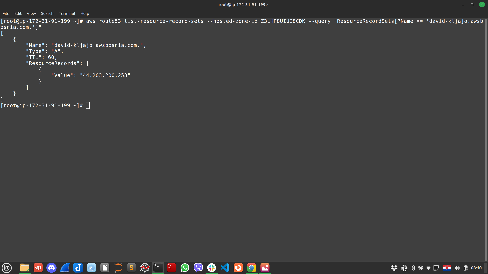

 

`aws route53 list-resource-record-sets --hosted-zone-id Z3LHP8UIUC8CDK | jq '.ResourceRecordSets[] | select(.Name == "david-kljajo.awsbosnia.com.") | {Name, Value}'`
- 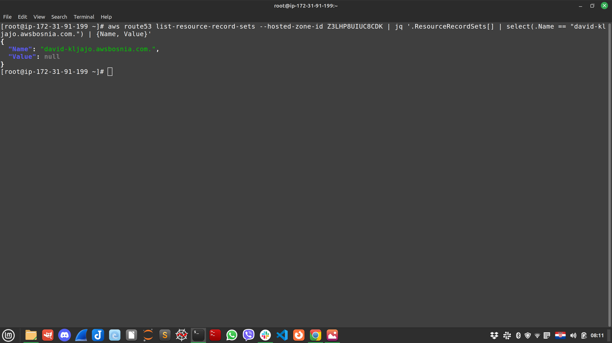
 
`sudo certbot certonly --nginx`
- ![10][./10.png)
 
` ls -la /etc/letsencrypt/live/david-kljajo.awsbosnia.com/`
- 

 

- 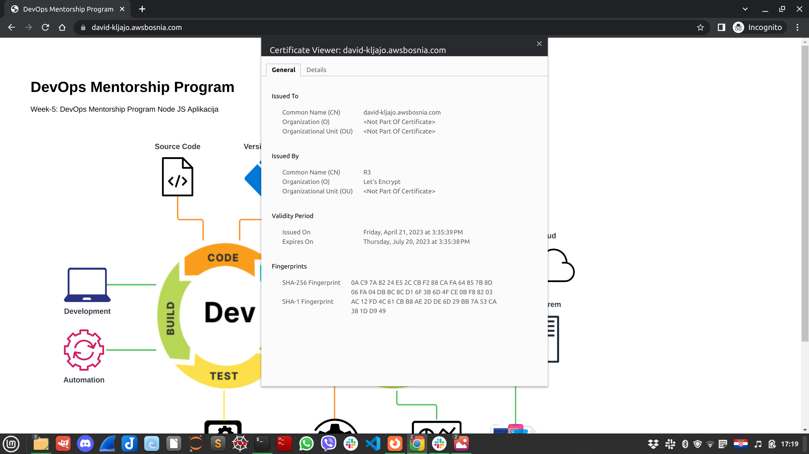
 
`echo | openssl s_client -showcerts -servername david-kljajo.awsbosnia.com -connect david-kljajo.awsbosnia.com:443 2>/dev/null | openssl x509 -inform pem -noout -text`
- 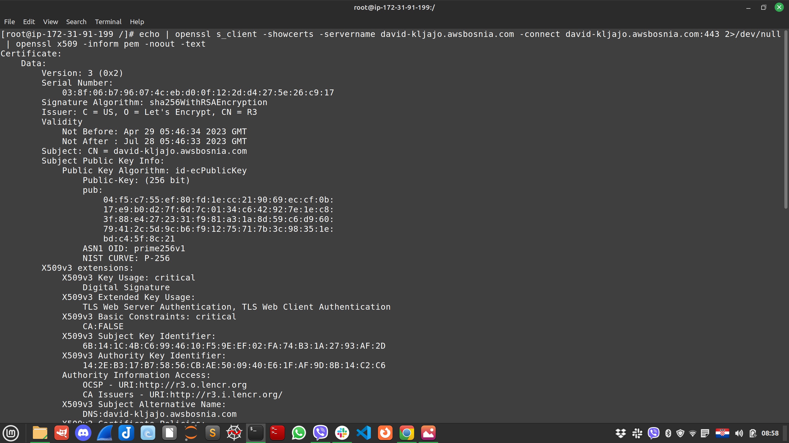
 
`openssl s_client -showcerts -connect david-kljajo.awsbosnia.com:443`
- 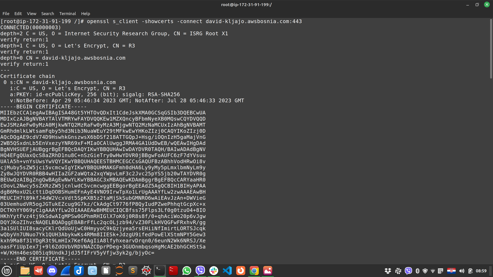
 
`cd /etc/letsencrypt/live/david-kljajo.awsbosnia.com/`
- 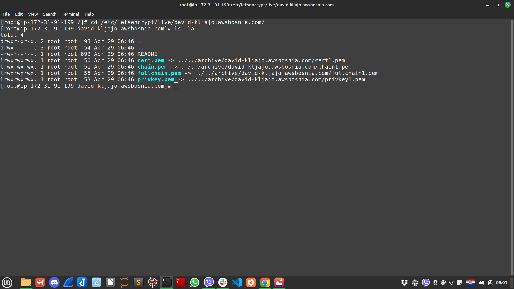
 

- 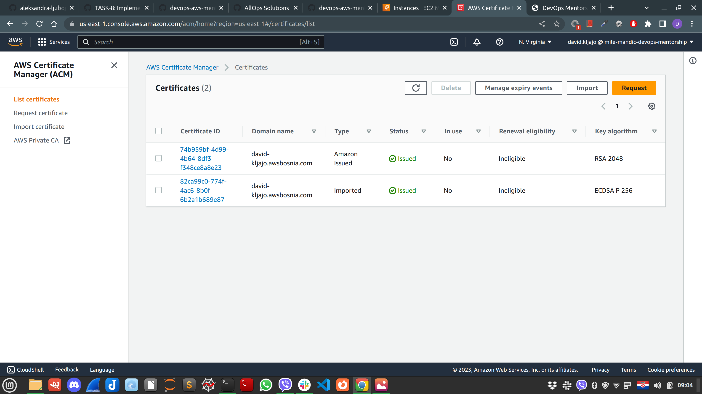
 
`node-app.conf # comment line in node-app.conf`
- 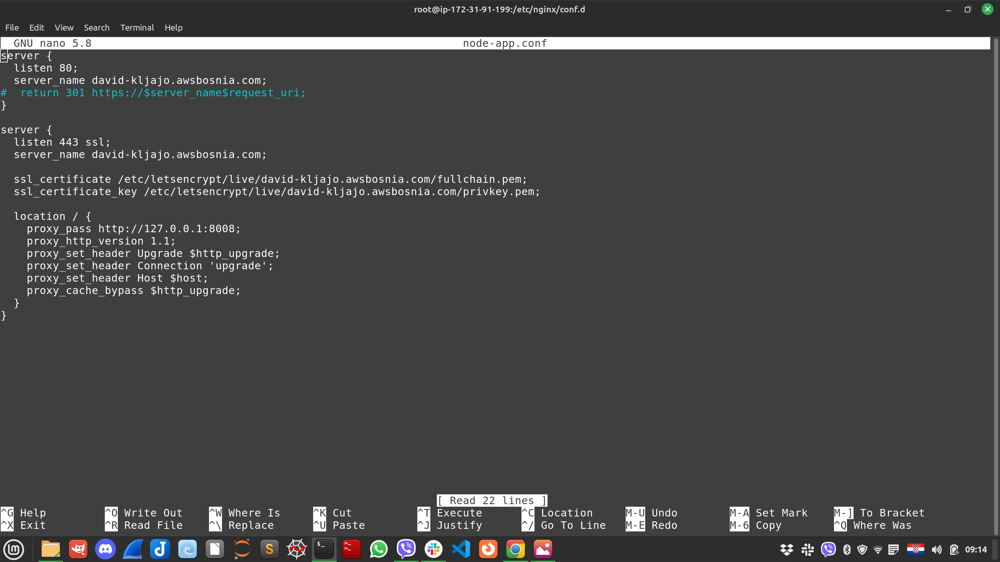
- 
`echo | openssl s_client -showcerts -servername david-kljajo.awsbosnia.com -connect david-kljajo.awsbosnia.com:443 2>/dev/null | openssl x509 -inform pem -noout -text`
- 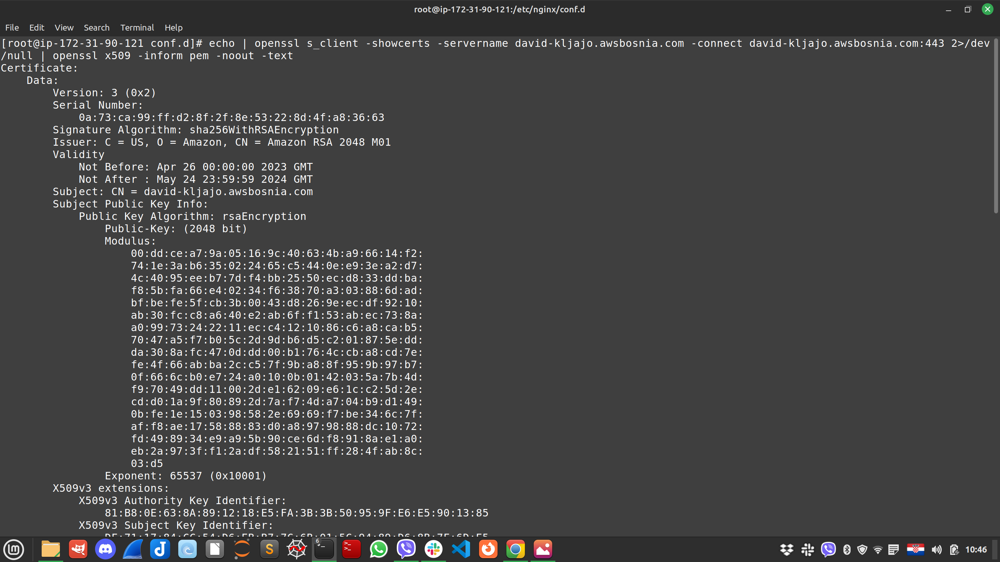
 

 - 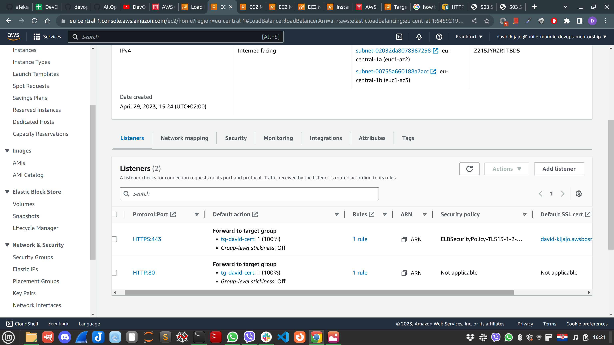
 
  - 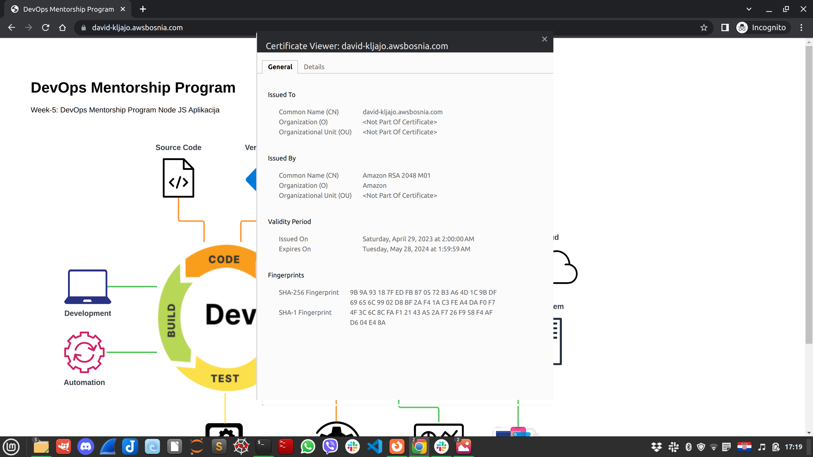
 
  - 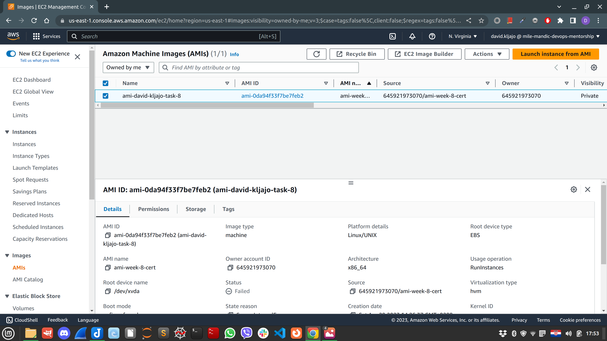

