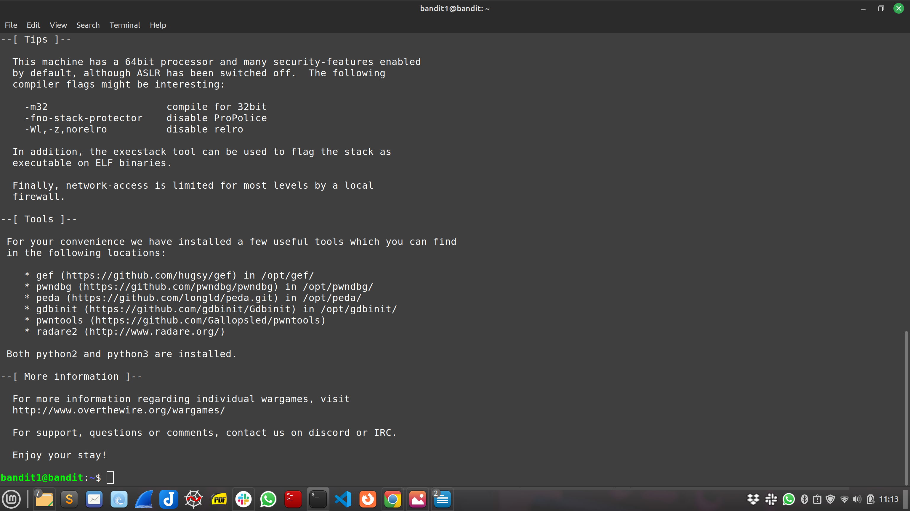
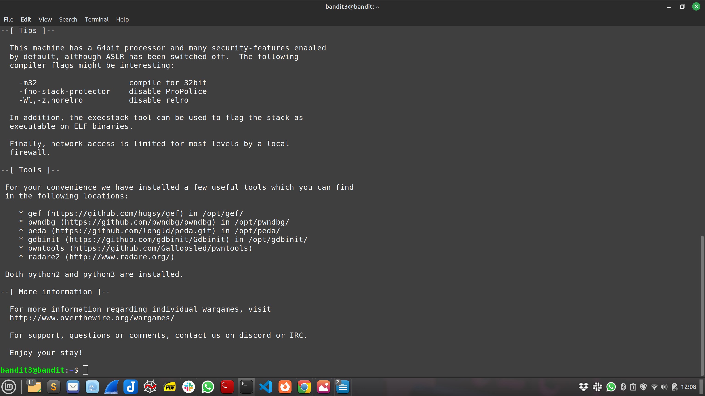
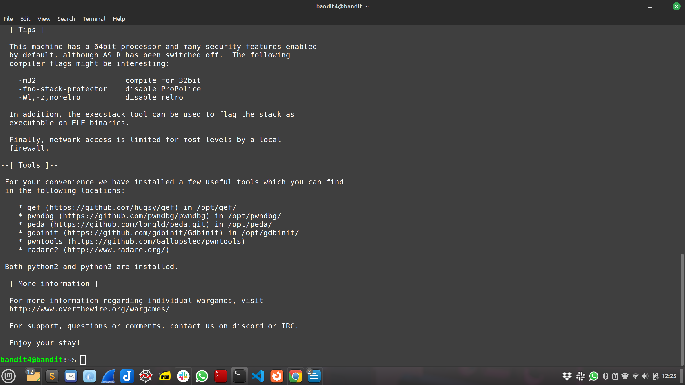
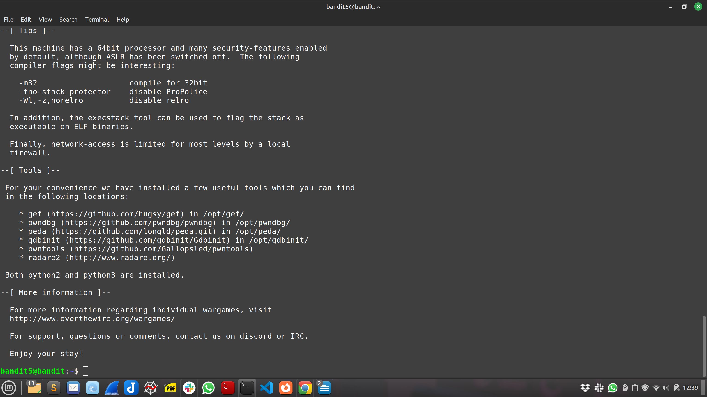
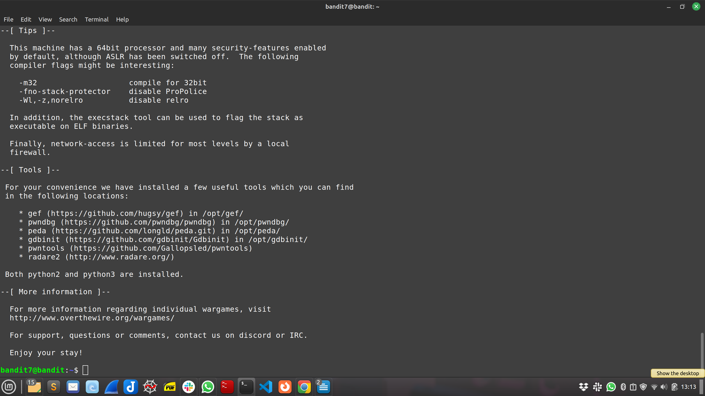
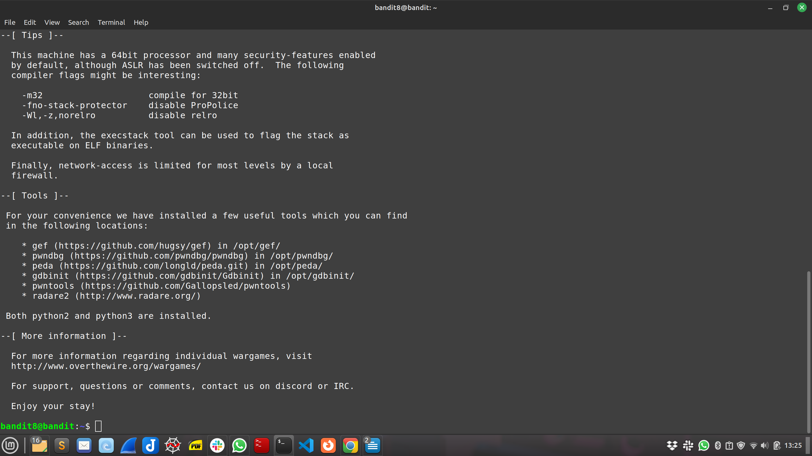

# Level 0

- Commands:

    - `ssh bandit0@bandit.labs.overthewire.org -p 2220` - Secure Shell protocol over port 2220

    

 

# Level 0 -> Level 1

- Commands:
    - `ls`
    - `cat` - command to view the content of `readme` file
    - `exit` - command to exit SSH session
    - `ssh bandit1@bandit.labs.overthewire.org -p 2220`

    
 

# Level 1 -> Level 2

- Commands:
    - `ls -lah` - command to list all files and hidden ones.
    - `cat ./-` - command to display contents in `-` file.
    - `exit` - command to exit current SSH session.

- Comments:
    - Command `cat -` to display file content did not work because `cat` command interprets `-` as a `redirection from / to stdin or stdout`.

    
 

# Level 2 -> Level 3

- Commands:
    - `cd` - change directory
    - `ssh bandit2@bandit.labs.overthewire.org -p 2220`
    - `cat "spaces in this filename"` - 

- Comments:
    - used quotation marks because of spaces inside of file name.

     
 

# Level 3 -> Level 4

- Commands:
    - `pwd` - print working directory
    - `ssh bandit3@bandit.labs.overthewire.org -p 2220`
    - `ls -lah` - command to list all hidden files and directories.
    - `cat .hidden` - view content of .hidden file.

     
 

# Level 4 -> Level 5

- Commands:

    - `reset`- command to reset messed up terminal.
    - `ssh bandit4@bandit.labs.overthewire.org -p 2220`
    - `file ./*` -  command to check which file content is in Human Readable format.
    - `cat ./-file07` - a file in Human Readable format

    
 

# Level 5 -> Level 6

- Commands:
    - `ssh bandit5@bandit.labs.overthewire.org -p 2220`
    
    - `find /home/bandit5/inhere -type f -readable -size 1033c ! -executable`
    - `ls -lah` - command to view all files including hidden ones.
    - `cat .file2`

- Comments:

    - `-type f` this indicates our interest in files.
    - `-readable` this indicates that file must be human-readable.
    - `-size 1033c` this indicates that file must be 1033 kb in size.
    - `!-executable` this indicates that file must not be executable.

    
 

# Level 6 -> 7

- Commands:
    - `ssh bandit6@bandit.labs.overthewire.org -p 2220`
    - `find / -type f -user bandit7 -group bandit6 -size 33c 2>/dev/null`

- Comments:

    - `find /` - command to s7earch the entire filesystem.
    - `-type f -user bandit7 -group bandit6` - command for a file owned by user bandit7 and group bandit6.
    - `33c` - file must be 33 bytes in size. 
    - `2>/dev/null` - added to redirect error messages to `/dev/null` so that we only see the output of the command.

     
 

# Level 7 -> 8

- Commands:
    - `ssh bandit7@bandit.labs.overthewire.org -p 2220`
    - `grep milionth data.txt` - no output.
    - `grep -w milionth data.txt` - still no output.
    - `awk '/millionth/ {print $NF}' data.txt` provided output.
    - When we run this command `awk` tool will search through the content of data.txt for lines that contain the word `milionth` and print the last field of the line which should be the output we are looking for.

- Comments:

    - `awk` - text processing tool. 
    - `/milionth/` - expression that instructs `awk` to search for lines that could contain the phrase `milionth`.
    - `{print $NF}` - command that prints the last field of any line that matches the search expression.

    
 

# Level 8 -> 9

- Commands :
    - `ssh bandit8@bandit.labs.overthewire.org -p 2220`
    - `ls`
    - `sort data.txt | uniq -u` - for the unique output.

- Comments:

    - `sort` command sorts the lines in a text file in alphabetical order [A - Z].
    - `uniq` command filters out duplicate lines in a text file and outputs unique lines,
    - `-u` that will output those lines that occur once.

    
 

# Level 9 -> 10

- Commands:

    - `ssh bandit9@bandit.labs.overthewire.org -p 2220`
    - `ls`
    - `grep "==*" data.txt -o` - to grep for strings containing one or more equal signs, but it doesn't work.
    - `cat data.txt | strings -e s | grep ==`

- Comments:

    - `cat data.txt` - outputs the content of data.txt.
    - `|` - pipe output from cat data.txt to strings -e s.
    - `strings -e s` - extracts printable strings from the input, `-e s` tells `strings` to look for 4 charaters long strings.
    - `grep ==` -e encoding
           Select the character encoding of the strings that are to be found.  Default value is s - readable in human format (ASCII) 

    